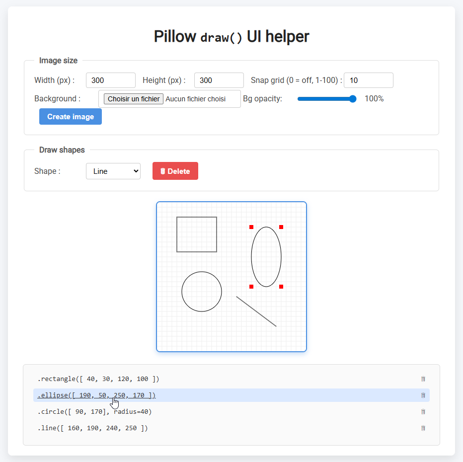

# `ImageDraw()` UI helper

> [!TIP] 
> Draw a rectangle on the screen and get its coordinates

# 💡 What

In a Python project I needed to draw a few shapes and I found it quite cumbersome to make coordinates `(x0 y0)` and such. So I made this little UI helper.

# ⚙️ Usage

Pretty straightforward:

1. Crate the canvas : width, height, background image if any
2. Simply draw shapes, resize and move them, and see their coordinates
3. Click on coordinates to copy them to clipboard
4. Make your life with Pillow ImageDraw simpler

Either use the 